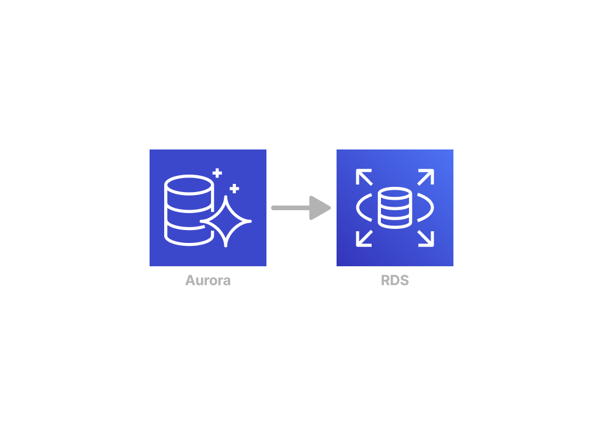
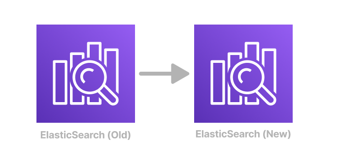

<h1 align="center">
  IDP Backups + Migrations
</h1>

<div align="center">
  <a href="https://github.com/ohsu-comp-bio/idp-backups/issues/new?assignees=&labels=bug&template=01_BUG_REPORT.md&title=bug%3A+">Report a Bug</a>
  ·
  <a href="https://github.com/ohsu-comp-bio/idp-backups/issues/new?assignees=&labels=enhancement&template=02_FEATURE_REQUEST.md&title=feat%3A+">Request a Feature</a>
  ·
  <a href="https://github.com/ohsu-comp-bio/idp-backups/discussions">Ask a Question</a>
</div>

<div align="center">
<br />

[](LICENSE)
[](https://github.com/ohsu-comp-bio/idp-backups/issues?q=is%3Aissue+is%3Aopen+label%3A%22help+wanted%22)
[](https://github.com/ohsu-comp-bio)

</div>

- [About](#about)
- [Migration Steps (RDS)](#migration-steps-rds)
- [Migration Steps (Elasticsearch)](#migration-steps-elasticsearch)
- [Additional Resources](#additional-resources)

---

# About

The steps below provide a guide for creating backups of PostgreSQL databases and Elasticsearch indices, restoring them to the new environment, and ensuring everything is configured correctly.

Each of the following steps be run incrementally, with the option to rollback at any time.

> [!TIP]
> While the specific examples involve migrating data between specific platforms (AWS Aurora, RDS, and ElasticSearch), the same steps should be applicable for data transfers between any standard PostgreSQL and ElasticSearch endpoints.

# Migration Steps (RDS)

<h1 align="center">
  <a title="Diagram source" href="https://www.figma.com/board/nrsDRwAAeSnt3gyXgA0y4V/IDP-Backup-%2B-Migration-Diagrams?node-id=0-1&t=2fG7FnSeWfNMfLJL-1">
    
  <a>
</h1>

## 0. Set Databases to Read-Only

Notify users that the IDP will be set to read-only to prevent data loss during the migration.

## 1. Record State

Record the state of the IDP before any modifications are made to be able to help verify that the migration was successful.

Note all information that is backed by the PostgreSQL databases, specifically:
- Existing permissions (e.g. JSON contents of https://aced-idp.org/user/user)

These values are expected to remain the same for all users given a successful migration.

> [!TIP]
> This method only records data for a single user and doesn't gurantee that the migration was successful for everyone else. However it does provide a quick comparison point, with more extensive validation in [Step 7. Test and Verify](#7-test-and-verify).

## 2. Create New Database

Set up the new RDS instance in the AWS console with the appropriate configurations.

## 3. Create Dump Files

### Set Environment Variables

```sh
export DEPLOYMENT='<DEPLOYMENT>'
export PGHOST='<RDS ENDPOINT>'
export PGUSER='<RDS USER>'
export DB_DUMP_DIR="/tmp/$DEPLOYMENT-db-dump"
mkdir -p $DB_DUMP_DIR
```

### Dump Global Objects and Roles

Dump global objects such as roles and tablespaces before dumping the individual databases:

```sh
pg_dumpall -h $PGHOST -U postgres -W --globals-only --no-role-passwords -f "$DB_DUMP_DIR/${DEPLOYMENT}_globals.sql"
```

### Dump Databases

```sh
dbs=(
  arborist
  audit
  fence
  indexd
  metadata
  peregrine
  requestor
  sheepdog
  wts
)

# Loop through each database and perform the dump
for db in "${dbs[@]}"
do
  echo "Dumping: $db to $DB_DUMP_DIR/$db"
  pg_dump -h $PGHOST -U $PGUSER -W -d ${db}_${DEPLOYMENT} -f "$DB_DUMP_DIR/$db"
done
```

## 4. Restore Dump Files

### Update Environment Variables

```sh
export PGHOST='<NEW RDS ENDPOINT>'
```

### Restore Global Objects and Roles

Restore global objects such as roles and tablespaces before restoring the individual databases:

```sh
psql -h $PGHOST -U $PGUSER -f "$DB_DUMP_DIR/${DEPLOYMENT}_globals.sql"
```

### Create New Databases

Ensure that the new databases are created:

```sh
SERVICES=(
    arborist
    audit
    fence
    indexd
    metadata
    peregrine
    requestor
    sheepdog
    wts
)

for DB in "${SERVICES[@]}"; do
    psql -h $PGHOST -U $PGUSER -c "CREATE DATABASE ${DB}_${DEPLOYMENT} OWNER $PGUSER;"
done
```

### Restore Databases

Load the dump files into the newly created databases:

```sh
for DB in "${SERVICES[@]}"; do
    psql -h $PGHOST -U $PGUSER -d ${DB}_${DEPLOYMENT} -f "$DB_DUMP_DIR/$db"
done
```

### Unset Environment Variables

Remove sensitive information from the environment:

```sh
unset PGPASSWORD
unset PGHOST
unset USER
unset DB_DUMP_DIR
```

## 5. Update Helm Values

Update `values.yaml` to point to the new RDS instance:

```yaml
global:
  # RDS configuration
  postgres:
    master:
      host: "<NEW RDS ENDPOINT>"
      username: "<NEW RDS USER>"
      password: "<NEW RDS PASSWORD>"
```

## 6. Deploy

Deploy the changes and restart the Kubernetes deployments to apply the new configurations:

```sh
# Delete all existing database jobs to ensure they run during the redeployment
kubectl delete pods -l app=gen3job
make $DEPLOYMENT

for SERVICE in "${SERVICES[@]}"; do
    kubectl rollout restart deployment/$SERVICE-deployment
done
```

## 7. Test and Verify

Ensure that Frontend Framework can connect to the new database and that file downloads are working as expected.

---

# Migration Steps (Elasticsearch)

<h1 align="center">
  <a title="Diagram source" href="https://www.figma.com/board/nrsDRwAAeSnt3gyXgA0y4V/IDP-Backup-%2B-Migration-Diagrams?node-id=0-1&t=2fG7FnSeWfNMfLJL-1">
    
  </a>
</h1>

## 0. Set Indices to Read-Only

Notify users that the IDP will be set to read-only to prevent data loss during the migration.

## 1. Record State

Record the state of the IDP before any modifications are made to be able to help verify that the migration was successful.

Note all information that is backed by the ElasticSearch indices, specifically the number of existing Patients and Files for each project in the Explorer Page.

These values are expected to remain the same for all users given a successful migration.

> [!TIP]
> This method only records data for a single user and doesn't gurantee that the migration was successful for everyone else. However it does provide a quick comparison point, with more extensive validation in [Step 7. Test and Verify](#7-test-and-verify-1).

Curl `_cat/indices` to check the total size of the Elasticsearch data:

```sh
curl -X GET "$GEN3_ELASTICSEARCH_MASTER_SERVICE_HOST:9200/_cat/indices?v&h=index,store.size"
```

## 2. Dump Indices

```sh
export ES_ENDPOINT="<DOMAIN ENDPOINT>"
export ES_EXPORT="/tmp/$DEPLOYMENT-es-dump"
mkdir -p $ES_EXPORT

multielasticdump \
    --direction=dump \
    --includeType='data,mapping,alias' \
    --input=http://$GEN3_ELASTICSEARCH_MASTER_SERVICE_HOST:9200 \
    --output="$ES_EXPORT"
```

## 3. Start AWS ES Proxy

```sh
wget https://github.com/abutaha/aws-es-proxy/releases/download/v1.5/aws-es-proxy-1.5-linux-amd64 -O aws-es-proxy
chmod +x aws-es-proxy

# This will start the proxy on localhost:9200 (in the background)
./aws-es-proxy -endpoint "$ES_ENDPOINT" &

curl localhost:9200/_cat/indices
# green open .kibana_1            pXhB98GhQbahWs6CVm_wVw 1 0 1 0    5kb    5kb
# green open .opendistro_security fhNILwnQQTaHVHIq9EP0-w 1 0 9 0 70.7kb 70.7kb
```

## 4. Restore Indices

Load the backed-up indices into the new domain using [multielasticdump](https://github.com/elasticsearch-dump/elasticsearch-dump?tab=readme-ov-file#multielasticdump):

```sh
multielasticdump \
  --direction=load \
  --includeType='data,mapping,alias' \
  --input="$ES_EXPORT" \
  --output=http://localhost:9200

curl localhost:9200/_cat/indices
# yellow open fhir                                    -es-HgrORbWFAceM9HHkQQ 5 1   0 0    1kb    1kb
# yellow open gen3.aced.io_file-array-config_0        61vCR5wRQEGBLw0TtGiRQA 5 1   1 0  5.2kb  5.2kb
# yellow open .kibana_2                               hsuSxgKMSE2pvRUcMyCBRA 5 1   0 0    1kb    1kb
# green  open .kibana_1                               pXhB98GhQbahWs6CVm_wVw 1 0   1 0    5kb    5kb
# green  open .opendistro_security                    fhNILwnQQTaHVHIq9EP0-w 1 0   9 0 70.7kb 70.7kb
# yellow open gen3.aced.io_observation-array-config_0 YYw5jqV1SjOdYGXK2ftrtQ 5 1   1 0  5.1kb  5.1kb
# yellow open default-commons-index                   5PhyJg_3SVOvJZpVAbNptQ 5 1   5 0 64.2kb 64.2kb
# yellow open default-commons-info-index              FPW8bLQqSsKwSmjBFYlGVQ 5 1  26 0 17.1kb 17.1kb
# yellow open gen3.aced.io_file_0                     YCzHI5pcS8yxe1M3NA2NAA 5 1 971 0  1.6mb  1.6mb
# yellow open gen3.aced.io_observation_0              OiXqJSJHR4SbmkwcEYkZbA 5 1   0 0    1kb    1kb
# yellow open gen3.aced.io_patient_0                  irvIWySsSg2TVpKO91D_jw 5 1  13 0   34kb   34kb
# yellow open default-commons-config-index            -2yTyNV6QQuAPYSK9fyLYw 5 1   1 0  4.2kb  4.2kb
# yellow open gen3.aced.io_patient-array-config_0     PUJKLsY8RPW191Mnzed-9Q 5 1   1 0  4.8kb  4.8kb
```

## 5. Update Helm Values

Update `values.yaml` to point to the new ES Domain:

```yaml
# ElasticSearch/OpenSearch configuration
aws-es-proxy:
  enabled: true
  esEndpoint: "<ES ENDPOINT>"
  secrets:
    awsAccessKeyId: "<AWS ACCESS KEY>"
    awsSecretAccessKey: "<AWS SECRET KEY>"
```

## 6. Deploy

Deploy the changes and restart the `aws-es-proxy-deployment` to apply the new configurations:

```sh
make $DEPLOYMENT

kubectl rollout restart aws-es-proxy-deployment
```

## 7. Test and Verify

Ensure that Frontend Framework can connect to the new database and that file downloads are working as expected.

---

# Additional Resources

- **[ohsu-comp-bio/load-testing](https://github.com/ohsu-comp-bio/load-testing)**: Load testing and benchmarking of the Gen3 system with [`k6`](https://k6.io/)

